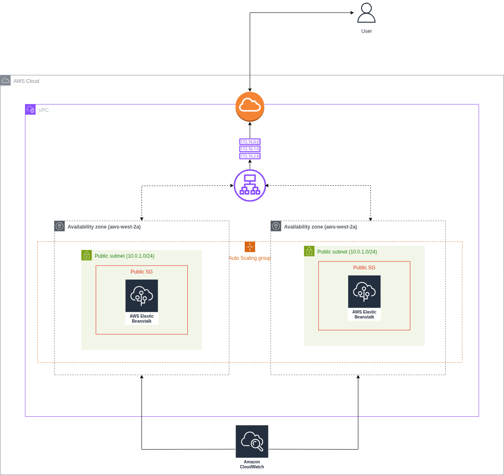

# Node.js Deployment on AWS Elastic Beanstalk  
A simple “Hello World” Node.js web application deployed using **Elastic Beanstalk’s ZIP upload method** (no Docker, no S3 pre-upload, no CLI). This project demonstrates the easiest and cleanest workflow for deploying and managing a Node.js app on AWS.

---

## Prerequisites
- An AWS account with permissions for:
  - Elastic Beanstalk  
  - EC2  
  - IAM  
  - VPC  
  - CloudWatch Logs  
- Node.js application packaged as a ZIP containing only the required files:
  - `index.js`
  - `package.json`
  - `package-lock.json` 
  - `public/` directory 
  - No `node_modules` directory (Elastic Beanstalk installs dependencies automatically)
- Basic understanding of Express.js and Node.js app structure

---
## Architecture Diagram

## What This Project Does
This project deploys a minimal Node.js “Hello World” App using the **Elastic Beanstalk Node.js platform**. It allows you to:

- Upload your application as a ZIP file directly from the AWS Console  
- Automatically provision:
  - EC2 instance(s)
  - Load balancer (optional depending on environment type)
  - Security groups  
  - IAM roles  
  - CloudWatch log groups  
- Automatically install dependencies using `npm install`
- Automatically set environment variables
- Run and manage your application with built-in health checks

---

## Resources Created by Elastic Beanstalk
Elastic Beanstalk automatically provisions the following resources:

### Core Resources
- **Elastic Beanstalk Application**
- **Elastic Beanstalk Environment**
  - Environment type: Web Server (Node.js platform)
- **EC2 Instance(s)** running Amazon Linux with the Node.js platform
- **Instance Profile and IAM roles** required for:
  - Deploying application versions
  - Running health reporting
  - Accessing CloudWatch Logs

### Networking Resources
- **Security Groups**
  - One attached to the EC2 instance
  - One attached to the Load Balancer (if enabled)
- **Public subnets** (when using default VPC or custom VPC)

### Monitoring / Logging
- **CloudWatch Logs group**
  - Application logs
  - Deployment logs (`eb-engine.log`)
- **Enhanced health monitoring**

Elastic Beanstalk manages all of these automatically — no need to create them manually.

---

## Deployment Approach Used
This project uses the **ZIP upload method** directly in the AWS Console:

- No Docker images  
- No ECR  
- No S3 bucket pre-uploads  
- No EB CLI  
- No containerization layer  

This results in the simplest possible Beanstalk deployment workflow:
1. Prepare your ZIP  
2. Upload  
3. Deploy  
4. Test the environment URL  

Elastic Beanstalk handles provisioning, deploying, logging, and health checks automatically.

---

## Summary
This project demonstrates the cleanest and most direct workflow for deploying a Node.js application using AWS Elastic Beanstalk with minimal configuration. Elastic Beanstalk manages all the underlying infrastructure (compute, scaling, logging, monitoring), while you simply upload your ZIP file and deploy.
